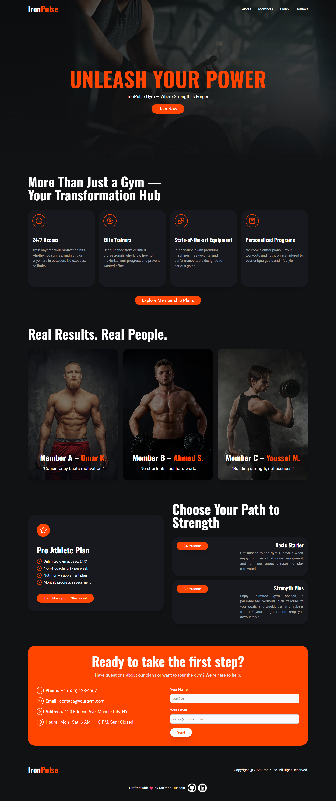

# IronPulse Gym – Landing Page  

**IronPulse** is a fictional gym brand designed to showcase bold visuals, clean UI, and strong user focus.
This landing page was created as part of a 4-project series, where each website explores a different design direction and UI challenge.

---

## 🚀 Live Preview

🔗 [Live Demo](https://ironpulse.vercel.app/)

---

## 🛠️ Built With

- **HTML5**
- **Tailwind CSS** (installed via CLI)
- **Lucide Icons** (via CDN)

---

## 🧩 Folder Structure

```text
Wellnest/
├── index.html
├── css/
│ └── input.css
│ └── style.css
├── img/
│ └── landing.jpg, person1.jpg, person2.jpg, person3.jpg
```

---

## 📷 Screenshots



---

## 🤝 Designed By

**Mo’men Hussein** — Front-End Developer
📬 [LinkedIn](https://www.linkedin.com/in/momen5406) | [GitHub](https://github.com/momen5406)

---